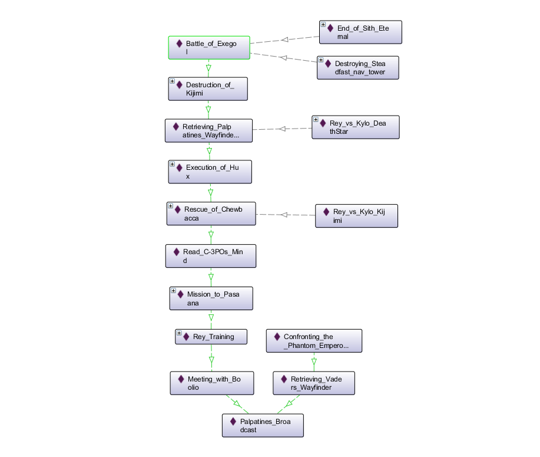

[home](../) |
[browse](https://www.star-wars-ontology.co.uk/) |
[docs](readme.md)

benefits |
[modules](modularisation.md) |
[events](events.md) |
[modelling principles](modelling-principles.md) |
[test questions](test-questions.md) |
[performance](performance.md) |
[tools](tools.md)

# Why Star Wars in OWL?

## OWL

[OWL](https://www.w3.org/OWL/) is the w3c standard for building ontologies for the Semantic Web.

An ontology is a knowledge model, containing classes, perhaps instances in
a domain, and the properties that relate them.

The idea of the Semantic Web is to have a Worldwide web of data, traversable
and computable by computers. An alternative term is "Linked data".

OWL was developed using "Description Logics"
that can be computed over, giving us the benefits of inference and reasoning.
In OWL DL, all assertions are logical axioms that have a well understood
formal meaning.

It brings with it many other benefits, on top of being a well understood standard.


## Inference

We can use a tool known as a reasoner to infer knowledge about our
Universe.

### Simple type inference

One of the simplest examples of this is type inference based on
the transitivity of subclasses.

    The Millenium Falcon is a YT-1300f_Light_Freighter
    YT-1300f_Light_Freighter is a subclass of Freighter
    Freighter is a subclass of Ship
    Ship is a subclass of Vehicle ... etc

Which we can use when reasoning about (querying) Vehicles, 

    Vehicle and ownedBy value Han_Solo

[result](https://www.star-wars-ontology.co.uk/dlquery/?expression=Vehicle+and+ownedBy+value+Han_Solo%0D%0A&syntax=man&query=instances)
includes the Millenium Falcon.


This works everywhere, within class descriptions

    Tobias_Beckett -> hadRole some Thief
    Thief is a subclass of Criminal

So we can ask for all Criminals

    hadRole some Criminal

[results](https://www.star-wars-ontology.co.uk/dlquery/?expression=hadRole+some+Criminal&syntax=man&query=instances)
include Beckett, thieves, smugglers, pirates and more

This gives us some freedom in modelling - see Specificity below

### Property inference

#### Subproperties

Exactly the same as classes, properties are arranged in a hierarchy.

eg an event in which people have different outcomes:

    Boba_vs_Bib: Murder
        of Bib_Fortuna
        victoryOf Boba_Fett
        witnessedBy Fennec_Shand

We can ask who were the participants in this event:

    participatedIn value Boba_vs_Bib

[result](https://www.star-wars-ontology.co.uk/dlquery/?expression=participatedIn+value+Boba_vs_Bib&syntax=man&query=instances)
includes all 3 because
[```of```](https://www.star-wars-ontology.co.uk/objectproperties/944795056/),
[```victoryOf```](https://www.star-wars-ontology.co.uk/objectproperties/1820579682/) and
[```witnessedBy```](https://www.star-wars-ontology.co.uk/objectproperties/471407080/) are
all subproperties of [```participant```](https://www.star-wars-ontology.co.uk/objectproperties/1712213772/)
(and [```participatedIn```](https://www.star-wars-ontology.co.uk/objectproperties/1115585508/) is the inverse of participant)

#### Transitivity

Transitivity is very useful for spatial, temporal and other
properties.

eg. Who was killed in the Mid Rim?

    inverse(of) some (Killing and during some (locatedIn value Mid_Rim))

[results](https://www.star-wars-ontology.co.uk/dlquery/?expression=inverse%28of%29+some+%28Killing+and+during+some+%28locatedIn+value+Mid_Rim%29%29&minus=&syntax=man&query=instances)
includes Qui-Gon Jinn who was killed in Theed, on Naboo, in the Mid Rim

eg. Who is related to Kylo Ren?

    relatedTo value Kylo_Ren

[results](https://www.star-wars-ontology.co.uk/dlquery/?expression=relatedTo+value+Kylo_Ren&syntax=man&query=instances)
includes Shmi

### Consistency checking

Assertions must be consistent with the rest of the model.

eg There can be no individual Female [Crolute](https://www.star-wars-ontology.co.uk/classes/-647403693/) 
as all of the species are Male.

The reasoner lets us [prove this](https://www.star-wars-ontology.co.uk/dlquery/?expression=Crolute+and+%28gender+some+Female%29&syntax=man&query=equivalents).

    Crolute and (gender some Female)

Equivalent to owl:Nothing, which is the empty set - ie no individuals could be a member of this class.

If we created a Female Crolute, it would make the ontology inconsistent.

## Open World

This is an ongoing story with gaps being filled all the time.

OWL implements an open world model where anything can be true until there is a statement
that makes that impossible.

For example, 2 individuals could be the same unless we make them distinct
explicitly or by inference (OWL does **not** make the "Unique Name Assumption").

### Unique Name Assumption (not made in OWL)

It feels odd to say Darth Vader won a podrace on Tatooine.
It's more intuitive to separate the two personas and talk about them in their
own contexts.
Then OWL allows us to state that Vader and Anakin are the same individual:

    Darth_Vader hadRole some Dark_Lord
    Capture_of_Tantive_IV participant Darth_Vader

    Anakin_Skywalker hadRole some Jedi_Knight
    Boonta_Eve_Classic_32BBY victoryOf Anakin_Skywalker

    Darth_Vader sameAs Anakin_Skywalker

#### Disjoints

By default, OWL allows individuals to be members of any number of Classes.
Disjoints allow us to assert that members of one Class cannot be members of another Class.
This can assist with consistency checking - helpful in catching modelling errors.
But, there are also useful queries we might want to make that require disjoints to work, eg:

    (hadRole some Jedi) and not(Human)

[results](https://www.star-wars-ontology.co.uk/dlquery/?expression=%28hadRole+some+Jedi%29+and+not%28Human%29&syntax=man&query=instances)
include [Aayla_Secura](https://www.star-wars-ontology.co.uk/individuals/734701917/)

This only works because there are disjoints between [Living_Things](https://www.star-wars-ontology.co.uk/classes/-1864795183/) 
(at each level below that including [Humanoids](https://www.star-wars-ontology.co.uk/classes/1550378358/))

### Negative assertions

We assert those that we know to be force sensitive so we can ask:

    Human and (connectedTo some The_Force)

But, if we ask for those that aren't Force sensitive:

    Human and not (connectedTo some The_Force)

We do not get any results.

This is because in OWL we would have to assert that someone
was not force sensitive - just omitting the information about
them being force sensitive is not enough.

In this Universe, it would be quite strong to assert someone was not force sensitive
- at what level is someone "sensitive"?
- it might just not be apparent within the stories we know
- or intentionally hidden by an individual

So, knowing someone is not force sensitive is not the same as
not knowing if they are force sensitive (maybe they don't know themselves)

It can still be useful to ask "who is not known to be force sensitive?". Especially as a check during authoring.
We can use set arithmetic to ask this question as 2 queries:

1) instance of ```Living_thing```
2) instances of ```connectedTo some The_Force```

Then, we simply remove all results of query 2 from the results of query 1.

[results](https://www.star-wars-ontology.co.uk/dlquery/?expression=Living_thing&minus=connectedTo+some+The_Force&syntax=man&query=instances)

Or [Events C-3PO was without R2-D2](https://www.star-wars-ontology.co.uk/dlquery/?expression=participant+value+C-3PO&minus=participant+value+R2-D2&syntax=man&query=instances)

## Properties create a network or graph

Any property can be navigated as a graph, whether or not they are
transitive.

eg Event sequence (after/before) and containment (during)




## Specificity

We have ways of modelling that can leave out unknown details or 
keep our level of commitment low.

### Choosing a level of commitment

Classification allows control over how specific we wish to be:

eg Killing and (of some (hadRole some [Fighter](https://www.star-wars-ontology.co.uk/classes/1749936246/) /
[Trooper](https://www.star-wars-ontology.co.uk/classes/1555341112/) /
[Stormtrooper](https://www.star-wars-ontology.co.uk/classes/-2145398193/) /
[Scout Trooper](https://www.star-wars-ontology.co.uk/classes/938884855/)))

### Naming

There is no need to name everything:

eg - we can talk about [Rey's](https://www.star-wars-ontology.co.uk/individuals/944873567/) parents without having to name them.
    
    Rey -> hadFather some ( Human and wasCloneOf value Darth_Sidious)

### Ranges

eg People can be born in a range of years - eg [Din Djarin](https://www.star-wars-ontology.co.uk/individuals/-1440592085/) was born before 19BBY

    Din -> born some int [<="-19"(int)]

## Modularity

An ontology built in modules allows:
* focused engineering - keep parts of each story together in one place -
eg [rogue one](https://www.star-wars-ontology.co.uk/ontologies/-769536717/)
* optimisation - expensive modelling/reasoning can be separated off -
eg [hasPart](https://www.star-wars-ontology.co.uk/objectproperties/1641606534/),
[hasTrait](https://www.star-wars-ontology.co.uk/objectproperties/1075404653/)
* layering of knowledge - detail can be moved into other modules - 
eg [manufacturers](https://www.star-wars-ontology.co.uk/objectproperties/1543163192/)
* visibility - out of Universe or non-public knowledge can be in their own models - 
eg [behind-the-scenes.owl.ttl](../ontologies/behind-the-scenes.owl.ttl)
* extensibility - responsibility for content can be distributed to other fans

There is a tradeoff with the fluidity of developing one ontology

See [modularisation](modularisation.md) for more details.

## Referencing

We can reference any number of sources to our entities/assertions - currently [Wookipedia](https://starwars.fandom.com/)

We could reference images/videos - many ontology tools recognise common formats eg jpg.
But, we would need permissions on images and hosting or hot linking etc so this is out of scope.
