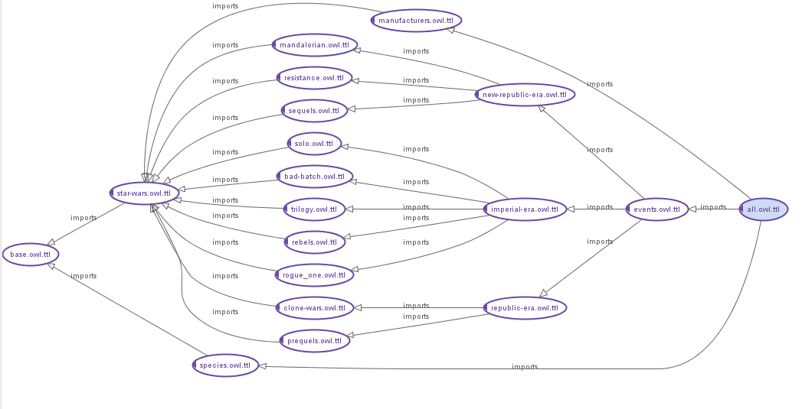

[docs](index.md) |
[benefits](benefits.md) |
modules |
[events](events.md) |
[modelling principles](modelling-principles.md) |
[test questions](test-questions.md) |
[performance](performance.md) |
[tools](tools.md)

# Modularisation

## Options for modules

* QA - eg domain/range checks
* out-of-universe metadata (actors, directors, creators)
* print/game/toy canon content
* deep content (more in-depth descriptions of species/planets etc)

## Issues

This is a dynamic, large and forever changing domain.
Some of the benefits of modularising increase as the domain gets larger.

However, in order to keep things manageable, assertions should ideally not need to be retracted or moved once stated.

Therefore, we would like a module scheme that allows for characters/places/objects to show up in multiple places in future without having to extract them back out to the more general ontologies. 

Any character in a  sub-module is at risk of this as they are very "mobile" in the storytelling.
In addition, they inevitably relate back to "main" individuals that must be in the core ontologies -
this can defeat our modelling principles of turning relations around in order to allow the modules to work (eg parent/child)

Only events should be modelled outside the core modules? Even these are becoming
more "mobile" as timelines are interlinked in the storytelling
(eg The [`Hosnian Cataclysm`](http://star-wars-ontology.herokuapp.com/individuals/-580865096/)).
We will then assert their links in the timeline of each module.

The only alternative is to accept constant moving or duplicating assertions in multiple places when characters cross over - but what level of duplication is ok?

If we get this right, the characters will be in the main ontology and then we'll
get a different "view" of them depending on which sub-modules we pull in.

## Structure

    
## Modules

### [all](http://star-wars-ontology.herokuapp.com/ontologies/1076521066/)

Top level ontology importing all content.

### [base](http://star-wars-ontology.herokuapp.com/ontologies/1600905306/)

Describes all Classes and Properties.
There are quite a small number of restrictions on classes at this level
as "only a Sith deals in absolutes".

Avoids referencing instance data - no named individuals

Which means we want to avoid making statements like "Mon Calamari are all from Mon Cala":

    Mon_Calamari subclassOf (originallyFrom value Mon_Cala)

Instead, we can have the weaker (but probably more accurate) definition of [Mon_Cala](http://star-wars-ontology.herokuapp.com/individuals/-1227980342/):

    Mon_Cala type (homeworldOf some Mon_Calamari)

### [star-wars](http://star-wars-ontology.herokuapp.com/ontologies/2046084515/)

Instance level information about characters, places, objects and a
small number of events that are widely referenced in the wider timeline.

A very small number of class level statements are made here - where the
axiom requires a reference to a named individual - eg:

    All Dark_Lords are inOrganisation Sith_Order
    All Clones are clones of Jango Fett
    All Imperial Star Destroyers are owned by the Empire

see [Dark_Lord](http://star-wars-ontology.herokuapp.com/classes/1095482871/), 
[Clone](http://star-wars-ontology.herokuapp.com/classes/1009995030/),
[Imperial-class_Star_Destroyer](http://star-wars-ontology.herokuapp.com/classes/2098826796/)

### Event ontologies

#### [events](http://star-wars-ontology.herokuapp.com/ontologies/-1519811390/)

Groups all events by importing all eras.

This is the ontology to load if you want to reason over events as the peripheral
ontologies with expensive modelling are not included.

#### [trilogy](http://star-wars-ontology.herokuapp.com/ontologies/1219913349/)

Events from the original trilogy

* chapter IV, A New Hope 
* chapter V, The Empire Strikes Back
* chapter VI, Return of the Jedi

#### [prequels](http://star-wars-ontology.herokuapp.com/ontologies/-477288162/)

Events from the prequel trilogy

* chapter I, The Phantom Menace
* chapter II, Attack of the Clones
* chapter III, Revenge of the Sith

#### [sequels](http://star-wars-ontology.herokuapp.com/ontologies/1997273779/)

Events from the sequel trilogy

* chapter VII, The Force Awakens
* chapter VIII, The Last Jedi
* chapter IX, The Rise of Skywalker

#### [rogue_one](http://star-wars-ontology.herokuapp.com/ontologies/2022284490/)

Events from the film

#### [solo](http://star-wars-ontology.herokuapp.com/ontologies/-1304173984/)

Events from the film

#### [mandalorian](http://star-wars-ontology.herokuapp.com/ontologies/-218785637/)

Events from 2 seasons

#### [resistance](http://star-wars-ontology.herokuapp.com/ontologies/910433378/)

Events from 2 seasons. The first season especially was challenging to model in the existing framework as there is less direct conflict and a lot of the story is relationship driven. We can use this experience to expand some of the more subtle plot points in the rest of the Universe.

There are links to the timeline of the sequels as yet to be resolved. eg Hosnian Cataclysm.

#### [rebels](http://star-wars-ontology.herokuapp.com/ontologies/-2033952650/)

Events from 4 seasons

#### [clone_wars](http://star-wars-ontology.herokuapp.com/ontologies/-224584084/)

Events from 7 seasons

#### [bad_batch](http://star-wars-ontology.herokuapp.com/ontologies/1898744479/)

Events from 1 season

### Eras

Grouping events by the timespan they occur during:

* [republic-era](http://star-wars-ontology.herokuapp.com/ontologies/1290432116/)
* [imperial-era](http://star-wars-ontology.herokuapp.com/ontologies/113414447/)
* [new-republic-era](http://star-wars-ontology.herokuapp.com/ontologies/2022931029/)

### Peripheral/deeper ontologies

#### [species](http://star-wars-ontology.herokuapp.com/ontologies/-852890927/)

Deeper characterisation of species by physiology/traits etc.

**Warning** - loading this ontology slows classification quite substantially

#### [manufacturers](http://star-wars-ontology.herokuapp.com/ontologies/-429733585/)

Characterisation of places/vehicles/droids and objects by who created them.

**Warning** - loading this ontology slows classification quite substantially

#### questions

Ontology containing some example defined classes that help to
classify individuals in the ontologies
