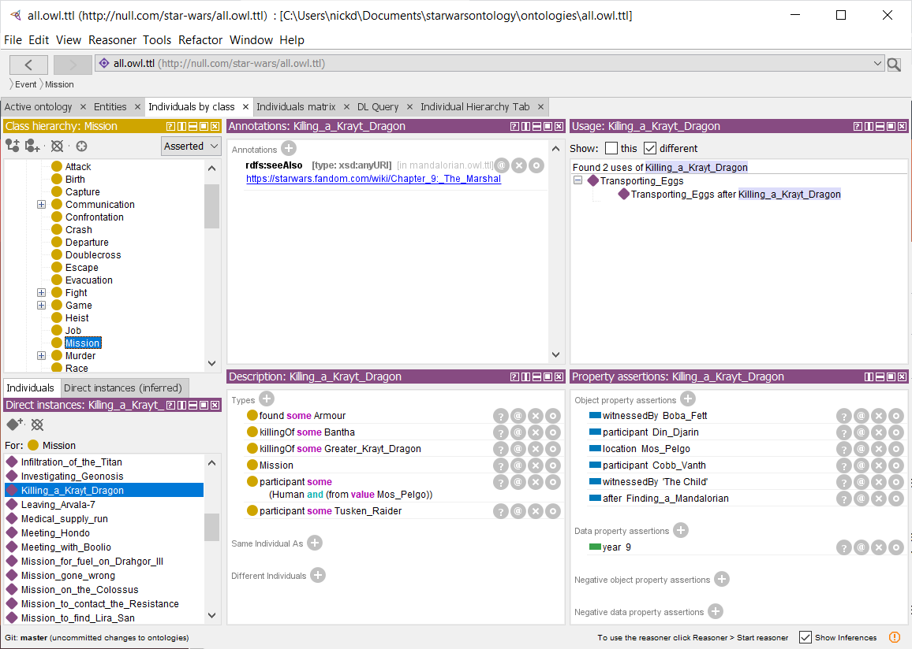

# Tools

[back to index](index.md)

## Protege

We used [Protege](https://protege.stanford.edu) to build this ontology

### Reasoning

Use the HermiT reasoner

* Select `HermiT` from the `Reasoner` menu.
* Select `Start Reasoner` to show inferences in the model

### Nice features of Protege

#### 

#### Individual Hierarchy Tab

Great for membership or temporal event relations
  * Requires the reasoner to be active for inv property tree
  * Select `hide orphans`
  * Navigate the `after` tree with `inverse property`
  * Temporarily remove `Transitive(location)` and navigate through from `Galaxy`
    * ships make this messy
    * lots of duplicate nodes in top level of tree - bug?
    
## Ontology Browser

HTML rendering of an ontology can be run locally using the [ontology browser](https://github.com/nickdrummond/ontology-browser)

### Use

* Get the browser - `https://github.com/co-ode-owl-plugins/ontology-browser`
* Start Mongo - `C:\Program Files\MongoDB\Server\4.4\bin`
* Start ontology browser - `mvn jetty:run`
* Navigate to `localhost:8080`
* Point it at local file: `file:///C:/Users/nickd/Documents/starwarsontology/ontologies/all.owl.ttl`

### Thoughts
* Nice to have cloud views - eg [instance usage](instances-usage-cloud.pdf)
* Can we add axioms (at least to the in-memory ont)?
* Can we then export/save changes?

### Bugs
* see ont browser