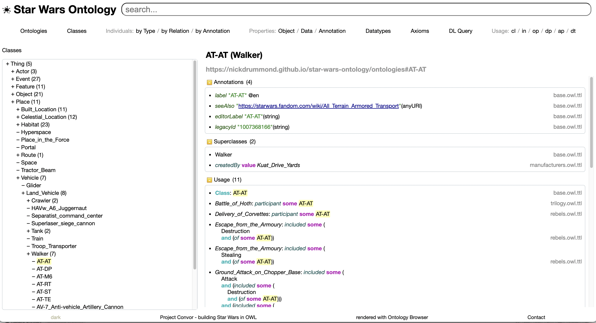
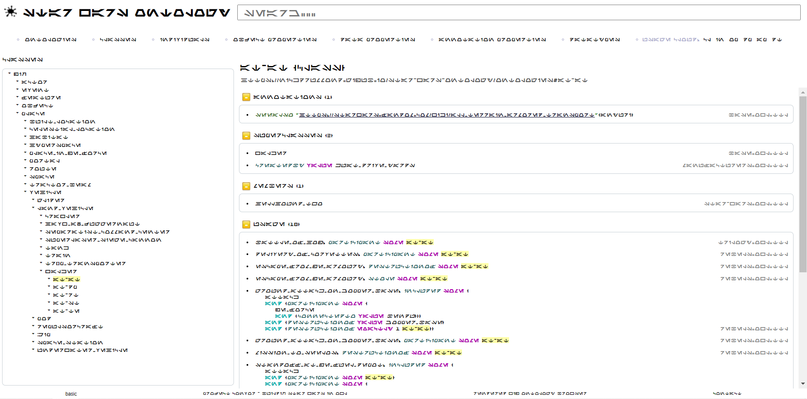

[home](../) |
[docs](readme.md) |
[benefits](benefits.md) |
[modules](modularisation.md) |
[events](events.md) |
[modelling principles](modelling-principles.md) |
[test questions](test-questions.md) |
[performance](performance.md) |
tools

# Tools

## Ontology Browser

A demo of the Star Wars Ontology is available to [browse](https://star-wars-ontology.up.railway.app/).

[Classes](https://star-wars-ontology.up.railway.app/classes/),
[properties](https://star-wars-ontology.up.railway.app/objectproperties/),
[individuals](https://star-wars-ontology.up.railway.app/individuals/) etc can all be browsed to understand the structure of the ontologies.
Cloud views can give a quick feel for where the detail is eg [instance usage](https://star-wars-ontology.up.railway.app/clouds/individuals)

This demo is a running on a [custom branch](https://github.com/nickdrummond/ontology-browser/tree/Star_Wars_Ontology_static),
paired version of the ontology browser, specifically loaded with [all.owl.ttl](https://star-wars-ontology.up.railway.app/ontologies/-1715300141).

It is hosted on railway.app using free-tier hardware so can take a moment to first start up. 

Querying with Pellet (Openllet) reasoner is possible on the [DL Query page](https://star-wars-ontology.up.railway.app/dlquery/).

This also supports set subtraction between queries which is useful where closure is not available.
Essentially mapping to "A is true but B is not known" (weaker than "A and not B").

Who worked for the Jedi Order that was not a Jedi?
[Cid, who was an informant](https://star-wars-ontology.up.railway.app/dlquery/?expression=Living_thing+and+%28memberOf+value+Jedi_Order%29&minus=hadRole+some+Jedi&syntax=man&query=instances)

You can even switch to Aurebesh if you prefer.

## Protege

We used [Protege](https://protege.stanford.edu) to build this ontology

### Reasoning

Use the Pellet reasoner

* Select `Pellet` from the `Reasoner` menu.
* Select `Start Reasoner` to show inferences in the model

Other reasoners are available, but each has different [performance](performance.md) issues

### Protege Known Issues

* Using Turtle as a file format means changes to base cannot be saved if other ontologies loaded 
  * bug raised - https://github.com/protegeproject/protege/pull/1025
* Selection model and entity focus is very buggy
  * clicking/finding an entity frequently does not navigate to that entity
  * sometimes the focus changes when adding relations/subclass axioms

### Protege Features

#### DL Query Tab

For off the cuff queries as simple as `year value -22`

#### Individual Hierarchy Tab

`after`
  * Select `hide orphans`
  * Navigate the `after` tree with `inverse property`
  * ideally use `during` for children and `before` for sibling order

`memberOf`

`location`
  * Temporarily remove `Transitive(location)` and navigate through from `Galaxy`
    * ships make this messy

Issues   
* Requires the reasoner - would be nice to also see asserted tree
    * eg transitivity makes the tree messy with individuals showing at all levels
* lots of duplicate nodes in top level of tree - bug?
* ideal if the nodes worked for selection, but they don't
* we'd require a more advanced tree ideally that allows ordering of siblings by a property (eg after)
    
#### OWLDoc

Export HTML rendering of the ontology for browsing (read only/asserted only).
Seems bugged now.
* html frames not working (in Chrome at least).
* entity pages contain lots of assertions about other entities - looks like this is due to the ontology being modularised.

## WebProtege

https://webprotege.stanford.edu/

More limited (eg cannot use a reasoner?)
But can import multiple ontologies and looks to have good multi-user support now.

https://protegewiki.stanford.edu/wiki/WebProtegeUsersGuide#Viewing_and_Editing_OWL_2_Ontologies
