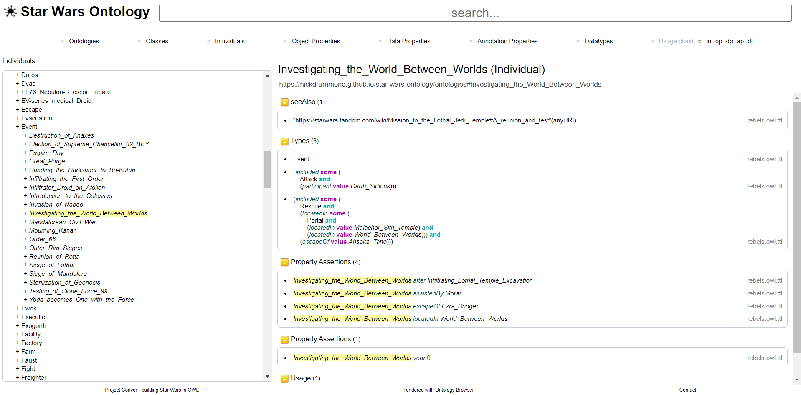

home |
[browse](https://star-wars-ontology.up.railway.app/) |
[docs](docs/)

[benefits](docs/benefits.md) |
[modules](docs/modularisation.md) |
[events](docs/events.md) |
[modelling principles](docs/modelling-principles.md) |
[test questions](docs/test-questions.md) |
[performance](docs/performance.md) |
[tools](docs/tools.md)

# Project Convor - Star Wars Ontology

[Convor](http://star-wars-ontology.up.railway.app/classes/-1326117872/), as in "OWL in Star Wars".

A hand-built [OWL ontology](docs/benefits.md) focused on events and covering characters, places and things in the films and TV series.

[Browse the ontology](https://star-wars-ontology.up.railway.app/) on railway.app
This currently only displays asserted content and DL queries.

## Metrics

| Content                                                                                                                  | Count |
|--------------------------------------------------------------------------------------------------------------------------|-------|
| [Events](http://star-wars-ontology.up.railway.app/dlquery/?expression=Event&syntax=man)                                   | 845   |
| [Characters](http://star-wars-ontology.up.railway.app/dlquery/?expression=Being+or+Droid&syntax=man)                      | 587   |
| [Species](https://star-wars-ontology.up.railway.app/dlquery/?expression=Living_thing&syntax=man&query=descendants)        | 194   |
| [Planets and Moons](http://star-wars-ontology.up.railway.app/dlquery/?expression=Planet+or+Moon&syntax=man)               | 142   |
| [Built locations](http://star-wars-ontology.up.railway.app/dlquery/?expression=Built_Location+and+not+Vehicle&syntax=man) | 155   |
| [Organisations or units](http://star-wars-ontology.up.railway.app/dlquery/?expression=Organisation&syntax=man)            | 129   |
| [Named vehicles](http://star-wars-ontology.up.railway.app/dlquery/?expression=Vehicle&syntax=man)                         | 124   |

| Structure             | Count  |
|-----------------------|--------|
| Axiom                 | 29,980 |
| Logical axioms        | 14,483 |
| Declaration axioms    | 3,213  |
| Individuals           | 2,135  |
| Classes               | 973    |
| Object properties     | 94     |
| Data properties       | 5      |

Above is a snapshot - see [ontology metrics](http://star-wars-ontology.up.railway.app/ontologies/) for current values.

## Status

* In progress - see scope below
* Open modelling questions - see [issues on github](https://github.com/nickdrummond/star-wars-ontology/issues)
* Tests and queries framework
* Modularisation of events by film/series

## Scope

| Content                     | Status                   |
|-----------------------------|--------------------------|
| Skywalker Saga episodes 1-9 | first pass               |
| Solo                        | first pass               |
| Rogue One                   | first pass               |
| The Mandalorian             | 2 of 3 series first pass |
| Resistance                  | first pass               |
| Rebels                      | first pass               |  
| Clone Wars                  | 3 of 7 series first pass |
| The Bad Batch               | 1 of 3 series first pass |
| The Book of Boba Fett       | first pass               |
| Kenobi                      | first pass               |
| Andor                       | to do                    |
| Tales of the Jedi           | to do                    |
| Ahsoka                      | to do                    |

## Contents

* [docs](docs/) - notes on specific modelling issues, discussion of the benefits of using OWL, and working docs
* [ontologies](ontologies/) - Ontologies in ttl (Turtle) OWL format. Start with [all.owl.ttl](ontologies/all.owl.ttl)
* [src/test](https://github.com/nickdrummond/star-wars-ontology/tree/master/src/test) - A set of Java tests against the ontology for quality checking etc
* [src/main](https://github.com/nickdrummond/star-wars-ontology/tree/master/src/main) - Transforms and other code
* [sparql](sparql/) - A set of Sparql queries to summarise or infer things about our ontology

## Usage

### Browse

[https://star-wars-ontology.up.railway.app/](https://star-wars-ontology.up.railway.app/)

Please be patient - this is on a basic railway.app stack for demo purposes only.

Browser contains [all.owl.ttl](ontologies/all.owl.ttl) and it's imports closure
(not [behind-the-scenes.owl.ttl](ontologies/behind-the-scenes.owl.ttl))

For efficiency, the query page only includes [event.owl.ttl](ontologies/events.owl.ttl) and
its imports - see [docs/performance.md](docs/performance.md)

### Edit/reason
* Open [all.owl.ttl](ontologies/all.owl.ttl) with open-source OWL editor, [Protege](https://protege.stanford.edu/) or
  another semantic web editor/browser
* Set the default reasoner to classify/reason with as `Pellet` on events.owl
* See [tools](docs/tools.md) for other tool related discussion

---

## Declaration

This work is not sanctioned or otherwise connected to Lucasfilm, Disney or it's affiliates. It is an unpaid experiment
in representing an interesting, complex domain of storytelling.

All names and references are Trademark and/or copyright of Disney and affiliates or their respective owners or creators.

There is no assertion of correctness or completeness by myself - content has been created referencing publicly
available, free content created by fans (ie Wookipedia).

That said, I would love to talk to Leland Chee about the possibilities of using RDF/OWL as a way of helping the
continuity and story group within the Star Wars teams.
